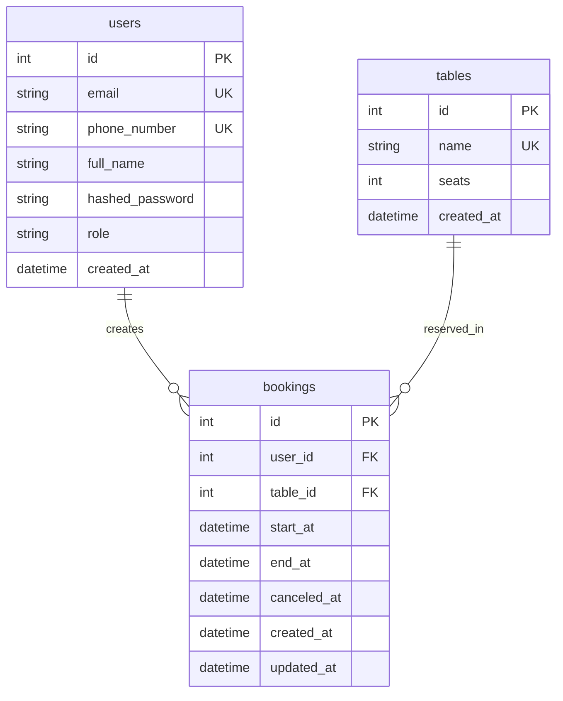

# ER Diagram

```mermaid
erDiagram
    users ||--o{ bookings : creates
    tables ||--o{ bookings : reserved_in

    users {
        int id PK
        string email UK
        string phone_number UK
        string full_name
        string hashed_password
        string role
        datetime created_at
    }

    tables {
        int id PK
        string name UK
        int seats
        datetime created_at
    }

    bookings {
        int id PK
        int user_id FK
        int table_id FK
        datetime start_at
        datetime end_at
        datetime canceled_at
        datetime created_at
        datetime updated_at
    }
```
